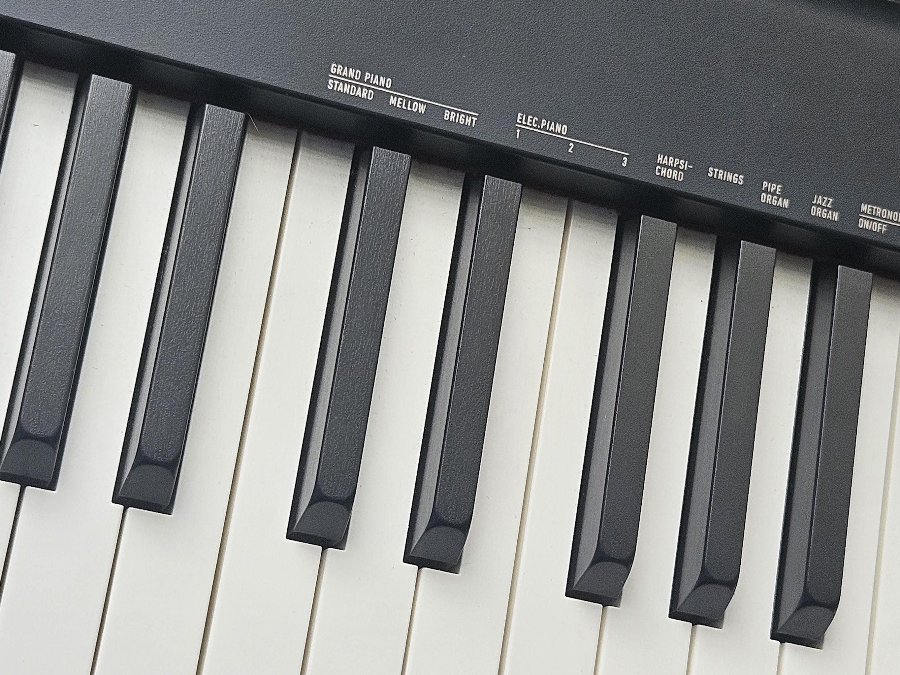

+++
title = 'About'
date = 2024-08-28T16:52:55+07:00
author = 'Vicyann'
featuredImage = ''
draft = false
+++

## About me
Hello,
I'm a Linux enthusiast (especially in Nix and NixOS) and I love using open-source software. Currently, I am studying Software Engineer at Ho Chi Minh University of Science. 
- **Nickname**: vicyann, vicyan1611
- **Music**: 
	- I usually listen to J-pop, game soundtracks, anime melodies,...
	- I'm learning to play piano. Hoping that I can play my favorite songs in the future
	- favorite bands: RADWIMPS, fripSide
- **Sport**: I can play almost any sports but my favorite ones are badminton, football and running
- **Books**: I used to read a lot a lot of light novels but currently, I also read IT technical books and books about soft skills 
- **Programming Languages**:
	- Python/C++: The languages I'm most familiar with
	- Nix/Lua: The languages I use to config my system
	- TypeScript/Javascript and "html/css": Mainly used when I need to create a website.
- **Technologies of Interest**:
	- Linux: I have tried and used some popular Linux distros in the past. The distribution I am using is NixOS, I love Nix because of its declarative nature, and thanks to it, I understand and know more about how a computer works.
	- Self-hosted, free, and open-source software: There are some people out there who create software for free and don't care about your data, so why not use that software instead?
	- NeoVim: I have started to use NeoVim recently, I love the idea of using an editor without leaving the keyboard.
- **Contacts**:
	- Telegram: https://t.me/vicyan1611
	- Email: vinhpham123.np@gmail.com

## About this blog
I write this blog because I want to save my knowledge for myself or share it with those who need that knowledge. This blog is also a record of my life adventure with technology and other things around me. 

I also want to improve my English writing skills, so maybe I will continue to write in English in the future. I also make a Vietnamese page for this website, but I'm too lazy to write.

I hope that you can find some good things that worth your time on my blog.
