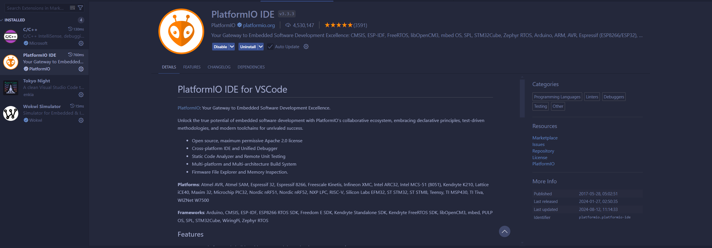
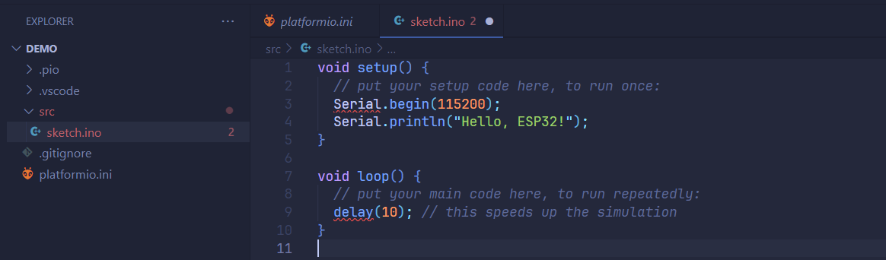
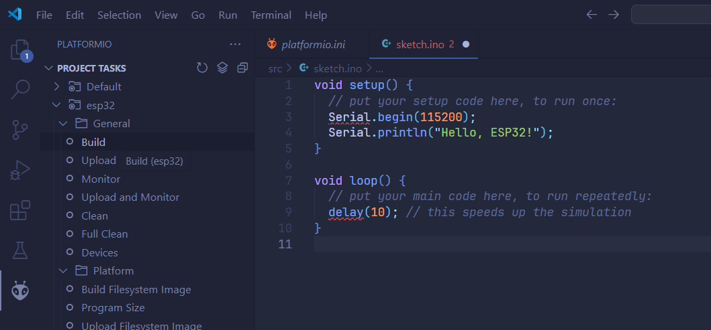
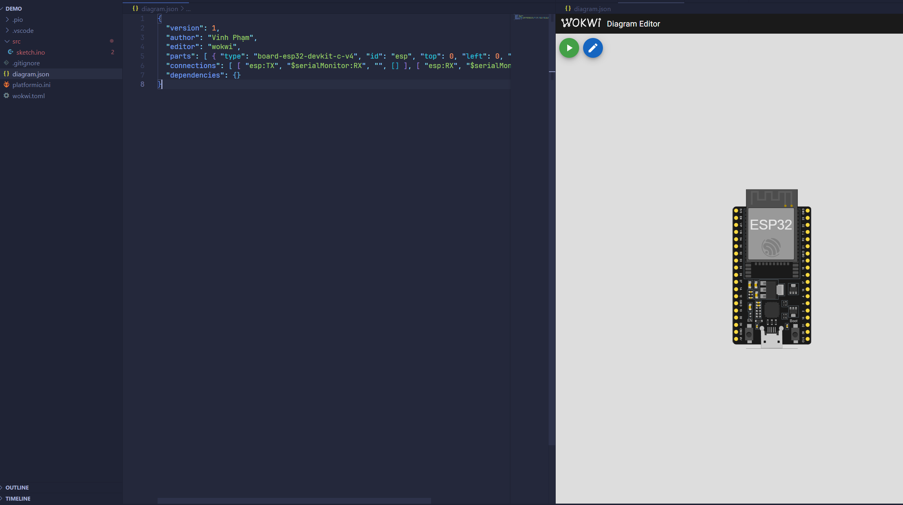

+++
title = 'Install and config Wokwi for VS Code'
date = 2024-08-12T21:28:08+07:00
author = 'Vicyann'
featuredImage = '/featured.png'
draft = false
+++
Before finishing the semester, we need to create an IoT device with an ESP32 board (we can use a real board or a simulator, though). We decided to use the simulator which is Wokwi to save costs. But the simulator has a long compile time on the web, so we need to use the local version which is Wokwi for VS Code. Having completed the installation and the setup process, I thought I would share my experience because the tutorial on the internet was not clear enough for my friends to follow.

This tutorial will show the most straightforward way to install PlatformIO to set up an environment and Wokwi for VS Code to simulate the hardware.
## Install PlatformIO
First things first, we need to install PlatformIO so that we can create an environment to run code on ESP32. To make it simple, we only need to install the PlatformIO extension on VS Code.

Next, create a file named `platformio.ini` with the following content
```platform.ini
; PlatformIO Project Configuration File
; Build options: build flags, source filter
; Upload options: custom upload port, speed and extra flags
; Library options: dependencies, extra library storages
; Advanced options: extra scripting
; Please visit documentation for the other options and examples

; https://docs.platformio.org/page/projectconf.html
[env:esp32]
platform = espressif32
framework = arduino
board = esp32dev
```
`platform` and `board` indicate that we will use an esp32 board and `framework` tells that our source codes will use Arduino and .ino files.
You can check [this link](https://docs.platformio.org/page/projectconf.html) for more information about how to configure this file.

After creating the init file, you can click on the PlatformIO extension and PlatformIO will automatically index and configure the environment.

Then, you need to create a folder to contain source codes, it needs to be named `src` so that when we can compile our code using PlatformIO.

*You can go to settings to disable the IntelliSense for Arduino projects so that it stops highlighting your codes as errors.*

Then you can compile the project by clicking `Build` on the PlatformIO extension.


## Install and config Wokwi for VS Code
After compiled our code, we need a platform to simulate the output, that's when Wokwi comes into play. Go to the extension store of vs Code and install the Wokwi extension, then get your license. You can check out [this link](https://docs.wokwi.com/vscode/getting-started) for more information.

Create a new file `wokwi.toml` in the root folder, this file will contain our config for wokwi to simulate the project.
```toml
[wokwi]
version = 1
elf = ".pio/build/esp32/firmware.elf"
firmware = ".pio/build/esp32/firmware.bin"
```
`elf` and `firmware` will contain the path to the binary file we have just compiled from PlatformIO. If you follow this tutorial, you can safely keep the same content as the `wokwi.toml` above. 

Finally, copy `diagram.json` file from your Wokwi project from Wokwi website and paste it into the root folder of the project, VS Code will open it as a diagram, not as a text file (because of the Wokwi extension).

Then you can start to simulate by pressing `F1` and selecting "Wokwi: Start simulator"

Every time you want to add devices or change the diagram, you need to go to Wokwi website and copy `diagram.json` again. When you change the code, remember to compile the code with PlatformIO before start running Wokwi simulator.

## Install library
Ok, cool, but how do I install additional libraries? 

You can change the content of `platformio.ini` or add it via the Graphical UI of the PlatformIO extension. It isn't that hard, so try to do it yourself.
