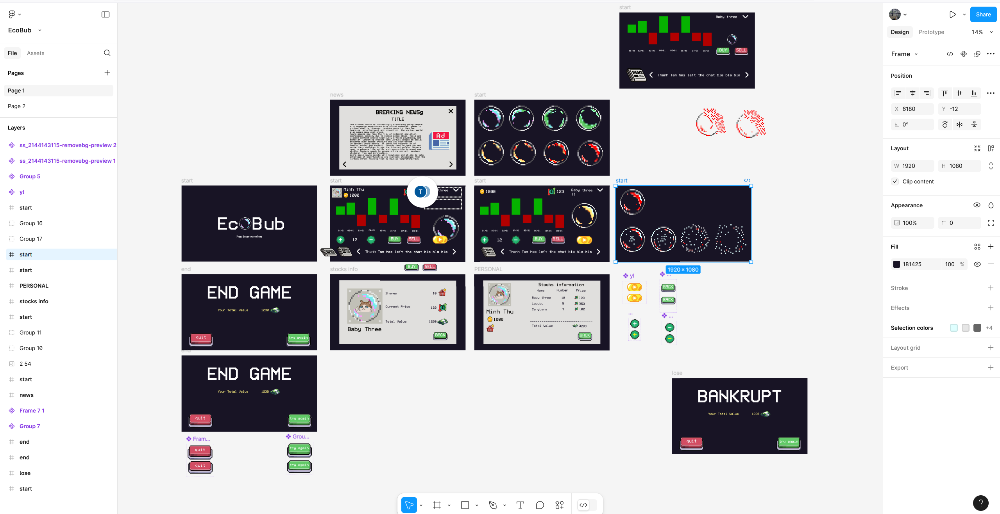

+++
title = 'Global Game Jam Viet Nam Diary: Creating "EcoBub" with my team'
date = 2025-01-23T23:25:35+07:00
author = 'Vicyann'
featuredImage = 'featured.jpg'
draft = false
categories = ['games']
+++

This year marked my first foray into the exhilarating world of game jams. Alongside my friends, I joined Global Game Jam, eager to tackle a challenge unlike anything we'd done before. We'd always heard that making games was tough, and we were curious to put that to the test. We decided to dive in headfirst.

Game Jams, for the uninitiated, are essentially hackathons for game development, typically spanning 24 to 72 hours. Our particular jam clocked in at 36 hours. The theme, revealed at the start, was "Bubble." While we hadn't prepared for this specific theme, some helpful advice from Mr. Hai Trinh encouraged us to explore the figurative meaning of the word. Our team consisted of graphic designers, who were talented but not specifically in 2D game art, and programmers, including myself.

## Ideation: From Economic Bubbles to "EcoBub"

Once the theme was announced, we brainstormed, throwing around various game concepts. One of my friends hit upon the idea of an "economic bubble," which immediately resonated with the group. It was a good concept, but we weren't sure what kind of gameplay to build around it. After an hour of intense discussion, we settled on a stock market simulator. The core loop would involve players buying and selling stocks, striving to maximize their profits before the inevitable economic bubble bursts. We also wanted to weave a narrative through the in-game news, giving players hints about the market and adding a layer of story discovery to the experience.

We chose this concept partly because it felt achievable. As software engineering students, we were more comfortable with familiar concepts than venturing into the unknown realms of 2D or 3D game development. We might not be game developers yet, but we know our strengths. We later changed our game title to "EcoBub"

## Development: A Sprint Through the Night

The first five hours were deceptively calm. We started at a relaxed pace, but the energy around us was intensive. Other teams were already hard at work, and as the night wore on, we found ourselves drawn into the intensity of the jam. We added more features, refined the textures and it became a blur of coding and creative problem-solving.

Our three designers tackled the textures and UI, working to give the game a polished look. Meanwhile, the programmers, including myself, focused on implementing the core mechanics and UI. We had a teammate dedicated to finding sound effects and soundtracks. To craft the in-game news and the underlying story, we used AI tools to help generate text and brainstorm ideas.

By the 30th hour, we'd completed the main development phase and moved on to testing and debugging. We were thrilled to have the core functionality in place, but then we hit a major snag. We were new to Godot, and we couldn't figure out how to properly send signals between the stock prices and the candlestick chart. Time was running out, so we made a tough decision: we used random numbers to drive the chart's movement. It wasn't ideal, but it was a functional workaround.

## Features: A Glimpse into "EcoBub"

- **Animated Bubble Graph:** Each stock was represented by a bubble that changed color based on the market's "panic" score, which we tracked with a variable. We wanted to use a `Tween` to implement size changing animation based on price changes, but didn't have enough time to implement it. We also don't have enough time to implement a line graph to track the price changes.
- **News System:** We designed a system where each news item would impact certain stocks with a specific score. We used some random functions to simulate the sometimes unpredictable nature of the market. It wasn't always perfect, but it added a fun element of chance!
- **Portfolio Panel, Stock, Buy/Sell Function:** These were implemented as intended, allowing players to track their investments and execute trades.

## Technical Challenges: Learning by Doing

This game jam was a true trial by fire. We were all new to Godot 4, and frankly, new to game development in general. Our approach was simple: learn by doing. Every challenge was an opportunity to dive into the documentation, discuss solutions as a team, or seek help from online resources when we were truly stuck.

One significant hurdle was our lack of experience working together as a team. We struggled to read each other's code, which made debugging a lot harder. It was a valuable lesson in the importance of clear coding practices and communication.

## The Final Hours: A Sleepy Sprint to the Finish

As the final hours approached, exhaustion set in. The early morning air was thick with fatigue, but we, along with the other teams, were determined to push through. We spent those last moments huddled together, fueled by adrenaline and a shared desire to see our game come to life.

I remember my teammate and I, barely able to keep our eyes open, still pecking away at the code, fixing one bug after another. We decided to prioritize bug fixes over new features, ensuring that our other team members could record a demo video.

## Lessons from the Bubble

We ultimately managed to create a playable game. It wasn't perfect (the candlestick chart was definitely a sore point!), but it was ours. This game jam taught me that you don't need to be an expert to start something new. You can learn as you go, and the process itself is incredibly rewarding. Game development, I discovered, is a lot of fun. I'm definitely planning to create some personal game projects and learn even more.

A huge thanks to the Global Game Jam Vietnam organizers and to Mr. Hai for creating such an inspiring event. And of course, a massive shoutout to my incredible teammates. We laughed, we struggled, and we created something together. It was an experience I'll never forget.
