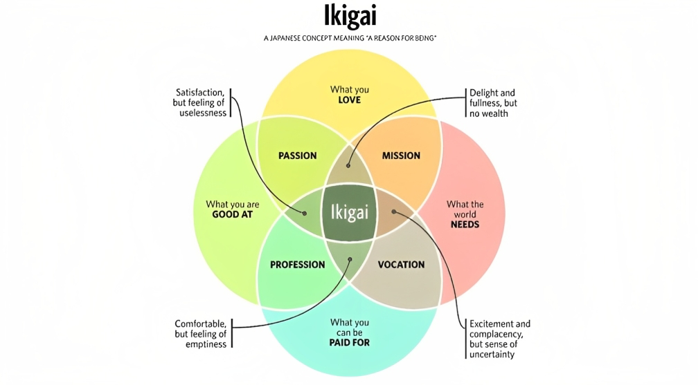
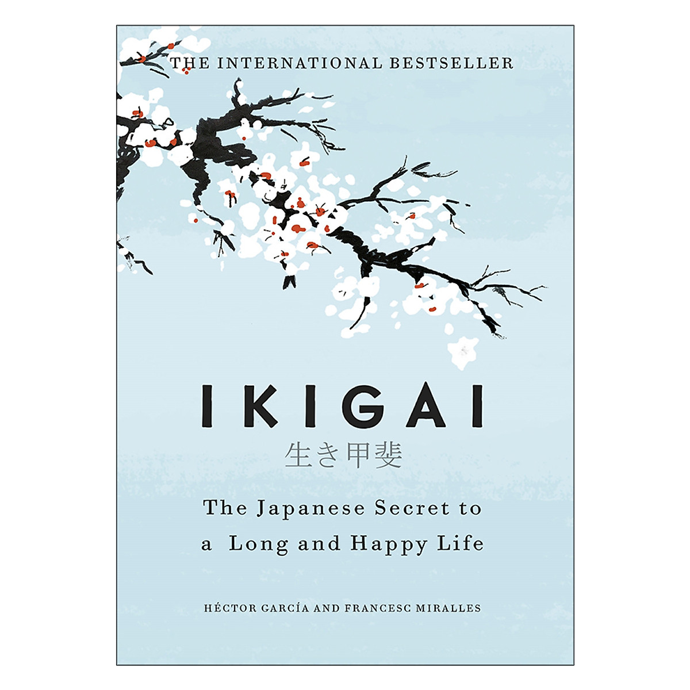

+++
title = "Awakening Your Ikigai: Ken Mogi's Five Pillars "
date = 2025-02-06T11:02:43+07:00
author = 'Vicyann'
featuredImage = 'featured.jpg'
draft = false
categories = ['books']
+++
I bought this book around 5 or 6 months ago but haven't finished it until now. At that time, I was stressed by a lot of things happening in my life, about score, about money and relationship things, and I heard about Ikigai so I want to check it out. I went to a local bookstore and looked for a book about Ikigai, but there weren't many books, and this book written by Ken Mogi had a beautiful cover and a good introduction, so, why not give it a try.

## About this book
I usually focus on solving problems and on things that I can break down and manage. So I didn't expect much from a book about something that sounded philosophical like life style. And I was... surprised.

Some information about the book:

- English Title: _Awakening Your Ikigai: How the Japanese Wake Up to Joy and Purpose Every Day_
- Vietnamese Title: _Ikigai, bí mật sống trường thọ và hạnh phúc của người Nhật_
- Author: Ken Mogi
- General theme: Introduction to the Japanese concept of ikigai, focusing on finding purpose in everyday life.

So, why I am writing the information about this book in both Vietnamese title and English title, because there is something not true. While Mogi's book offers a valuable, new perspective on ikigai, particularly through his 'five pillars,' the misleading marketing of the Vietnamese edition I read significantly detracts from its credibility and creates unnecessary confusion in the ikigai literature.
## Summary of the book
This book focuses on a different perspective of Ikigai, instead of 4 important elements that almost everyone knows. Mogi introduces "Five Pillars" of Ikigai, which are:
- Starting small: Emphasize the importance of beginning with small steps and focusing on incremental progress
- Releasing yourself: Highlights the significance of accepting oneself and letting go of any self-limiting beliefs or negative emotions that may be holding one back.
- Harmony and sustainability: This pillar emphasizes the importance of finding balance and harmony in one's life, both internally and externally. It encourages individuals to live in a way that is sustainable and in alignment with their values and beliefs.
- The joy of little things: This pillar highlights the importance of appreciating and finding joy in the small moments of life. It encourages individuals to cultivate a sense of gratitude and mindfulness, and to savor the simple pleasures that life has to offer.
- Being in the here and now: This pillar emphasizes the importance of being present in the moment and fully engaged in whatever one is doing. It encourages individuals to let go of worries about the past or anxieties about the future, and to focus on the present moment.

Central to Mogi's Ikigai understanding of ikigai is finding joys from small things, from everyday experiences. For example, in the book, Mogi talks about the joy of craftsmen perfecting small details, the joy of drinking things you like right after you wake up, the joy of savoring the tea ceremony. These small joys,  when experienced fully, contribute to a deeper sense of well-being and purpose, forming the foundation of one's ikigai. At first, I thought it a bit simplistic, but when I applied it to my life, I found my life was more enjoyable. Small things like debugging my code, I start to enjoy finding and fixing small errors, to make my project become more polish.
## Analysis and Opinion
### The Five Pillars vs. The Four Elements
A popular approach to Ikigai is from career-oriented; ikigai, in this view, includes 4 elements: _what you love, what you're good at, what the world needs, and what you can be paid for_ . It can feel like a rigid algorithm, requiring all four conditions to be perfectly met before one can claim to have found their ikigai. This can be particularly daunting for those early in their careers, or those exploring different paths.

Mogi's "five pillars" offers a flexible way and more focused on internal state when finding Ikigai. One doesn't need to know what society needs, how much they will get paid, they can find ikigai within themselves.. They're less like a rigid algorithm and more like a set of guiding principles that can be adapted to changing circumstances.

For example, the pillar of "starting small" resonated with my experience in coding. Even the most complex software projects are built from small, manageable components. Focusing on those fundamental building blocks, rather than being overwhelmed by the scale of the entire project, is often the key to success. Similarly, "the joy of little things" can be applied to the satisfaction of debugging a particularly tricky piece of code, or the elegance of a well-written function. These small victories, accumulated over time, contribute to a larger sense of purpose and accomplishment.

While the four-element model might be useful for long-term career planning, I found Mogi's five pillars to be a more practical and adaptable framework for finding meaning in the day-to-day. They encourage a mindset of continuous improvement and appreciation, rather than a relentless pursuit of a singular, perfect "ikigai."
### The Problem with the Vietnamese Edition
After finishing Mogi's book, I started searching for online reviews.  I found a disturbing realization. [The Vietnamese edition](https://s.shopee.vn/7zxdK57lYp) I had read, "Ikigai, bí mật sống trường thọ và hạnh phúc của người Nhật," wasn't just _inspired_ by Francesc Miralles and Héctor García's popular book, [_Ikigai: The Japanese Secret to a Long and Happy Life_](https://s.shopee.vn/5pt8kFTuQO) – it was practically a clone in terms of cover design, color scheme, and even the title itself. It felt like finding a fake being sold as the real thing. And further research online revealed that it was García and Miralles' book, and not Ken Mogi, achieved the best seller. I also read [a review article](https://thehanoichamomile.com/2019/01/20/book-review-ikigai-bi-mat-song-truong-tho-va-hanh-phuc-cua-nguoi-nhat-ken-mogi/) from The Hanoi Chamomile and he pointed out the same thing.

This wasn't a simple case of similar titles; it was an unethical marketing strategy by the Vietnamese publisher, Nhã Nam. It felt like a bait-and-switch, leveraging the established recognition of García and Miralles' work to sell Mogi's. This "dirty marketing," as I see it, not only deceives readers but also significantly diminishes the value of Mogi's unique contribution. Personally, I connected more with Mogi's five-pillar approach, finding it more adaptable and less prescriptive than the four-element model. Seeing his work copied and nearly buried under another book's design felt terribly unfair, both to him and to readers looking for real information about Ikigai.
## Conclusion
In the end, Ken Mogi's book gives a good way to think about finding purpose, focusing on small things and being present. I liked his five pillars idea better than the usual four-part plan. But, the Vietnamese version of the book is a real problem. It looks like a copy of a different, more famous book, which is wrong and confusing. Readers should be careful and make sure they're getting the book they actually want.

Link to buy Ken Mogi's book: [here](https://s.shopee.vn/7zxdK57lYp)

Link to buy García and Miralles' book: [here](https://s.shopee.vn/7AOWKt3PzC)
