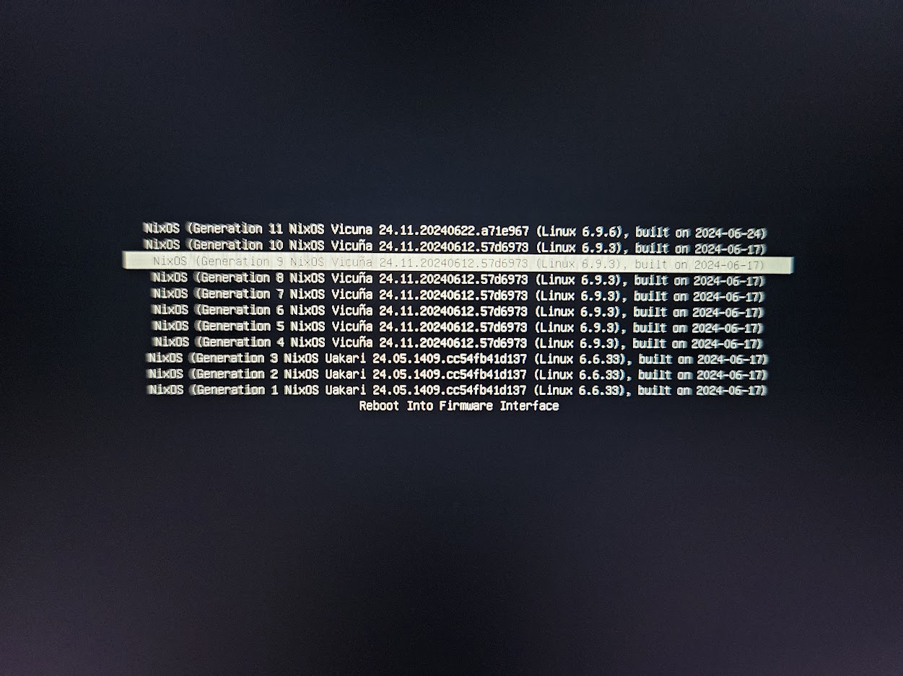

+++
title = 'Why I use NixOS and my experience with that system'
date = 2024-06-28T22:55:53+07:00
author = 'Vicyann'
featuredImage = '/featured.png'
draft = false
+++
I want to share my insights from a person who usually switches between Windows and Linux (NixOS) and my reason for using Linux (NixOS) as a daily driver.
## Why I use Linux
- Because Linux respects my hardware resources. I don't want to use my system resources for anything like the weather in the taskbar, Cortana, Windows Copilot, or something like that. If I need them, I will install them, I don't need Microsoft throwing them at me.
- Because I don't want to be tracked by something like the Recall feature on Windows. Microsoft said that they don't send any data to the servers but who knows? 
- I want to support the FOSS community: To be true, there are a lot of good free (freedom) software and open source software out there made by some people who are very talented and willing to make good software for the community. I don't want to be tied with any software or operating system, something like "I need Visual Studio to code", "I need Photoshop to edit images",...
- I want to make my system work like I want, not how to use them. For example, when I want to change workspaces in Linux, I can configure the buttons however I like, but in Windows, I need to learn Microsoft's hotkey.

The next part is why I use NixOS.
## The declarative of NixOS
In NixOS, all of my settings are stored in config files, so that I can always know what software is inside my system and I don't need to care about how to install those apps.
## Easy to rollbacks
I choose Linux because it is more customizable than Windows and I can do everything I want with my systems. Because of the customization, the system can be broken sometimes, and I need to have an easy way to roll back to the previous system as fast as possible without reinstalling everything from the start. By using NixOS, I can achieve those things pretty easily. Every time I rebuild my system with new config files, NixOS will create a new entry in the boot menu and keep all old ones, so that if anything goes wrong, I can always go back.

In case I need to reinstall NixOS, I can always use a simple build command to install the whole system to the state I want (with the config files).

## Reproducible
By using config files, I can reproduce the same system on other computers without worrying that anything will go wrong. And because I have two laptops, NixOS actually helps me a lot.

Before using NixOS, I was using Fedora and Linux Mint. When using them, I encounter some problems and need to install some software, find some ways to fix them (by using a terminal, of course). Several months later, I needed to install those distros on another computer and those problems appeared again, I needed to fix them again =)).

Meanwhile, with NixOS, I can find a way to fix and add them to config files. If I need to reinstall the OS on another computer, I can just use those config files without worrying about any errors.

## My experience with NixOS
I started using Linux again about 2 months ago, this time, I chose NixOS because of [ryan4yin's post](https://thiscute.world/en/posts/my-experience-of-nixos/). I installed two of them on my two laptops and slowly learned things about NixOS.

After installing  NixOS with gnome, I started to install hyprland because honestly, I can make it look however I like. But because of the nature of NixOS (non-FHS), there are no hyprland install scripts, and I have to reinstall everything for my desktop myself like Bluetooth, and screen capture,... Of course, there are some hyprland pre-config using flakes but at that time I am not ready to learn any new things about flakes ~ 
By installing and using hyprland, I started to know what makes a desktop environment. I install Bluez for Bluetooth, Waybar for a bar, and Grim and Slurp for Screenshots,... Everythings need a software to do their jobs.

After a desktop environment, a text editor is what I need, because I want to do my code homework. I think about NeoVim because I really love the idea of coding without using the mouse. And I started to learn NeoVim, after a short overview on Youtube, I realized that I can use preconfig NeoVim distros like AstroNvim, LunarVim,... or I can set up a config for myself. As I wrote above, I want the system work like I want, not how to use it. I followed [typecraft's playlist](https://youtube.com/playlist?list=PLsz00TDipIffreIaUNk64KxTIkQaGguqn) and config nvim myself. And to be honest, changing to NeoVim is one of my best decisions ever.

What about playing games, after I can learn and code, I also want to play video games. I usually play genshin, so I need to find a way to install that game on NixOS. Luckily, the game can be played on Linux (via Proton) without tweaking or doing any hard things, so I managed to install it successfully. You can read my post [Gaming on NixOS](https://vinhphamthanh.dev/posts/gaming-on-nixos/)

Currently, I am planning to make a virtual home lab with my old laptop so that I can try new things and have more experience with Linux and NixOS.

## Conclusion
From just 2 months of using NixOS, I can learn and know a lot of things about Linux and software. I hope that this post can give you some inspiration to switch to Linux or start using NixOS.....

